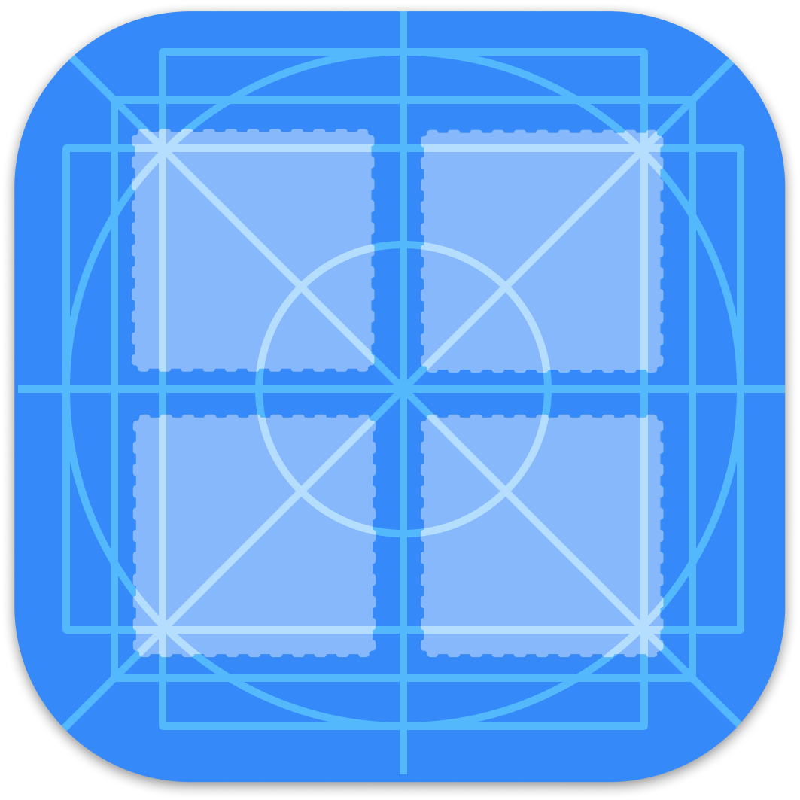

# Stencil v2 UI Simulator

Welcome to the Stencil v2 UI Simulator. This app is to simulate data-driven UI components that are part of the approved Suzy design system.

It is intended to help the communication, experimentation and efficiency of layouts, components and creation of configurable data-driven components.

THIS PROJECT IS ACTIVELY BEING DEVELOPED AND IS UNSTABLE FOR PRODUCTION USE

## Further help

To get more help on the Angular CLI use `ng help` or go check out the [Angular CLI Overview and Command Reference](https://angular.io/cli) page.
